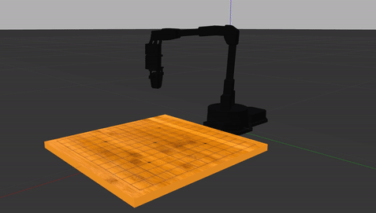

# Go Playing Robot 
I used a ReactorX200 arm to play go. This project has a few components. I first programmed the robot using MoveIt to pick and place go pieces in Gazebo. I then implemented a deep reinforcement learning agent to play go. Finally, I created a simple web interface to allow people to play go against the robot remotely. 

# Running the Robot in Gazebo 
To run the robot in Gazebo with MoveIt, run <br />
```roslaunch interbotix_moveit interbotix_moveit.launch robot_name:=rx200 use_gazebo:=true``` <br />
To start the node which manages the physical robot run. This will allow us to do pwm control of the gripper <br />
```roslaunch interbotix_sdk arm_run.launch robot_name:=rx200 gripper_operating_mode="pwm"``` <br />
For more information on what the arm_run.launch file does, read the interbotix_sdk/README.md file

# Results So Far
I have implemented the major ROS services for doing the picking and placing of the go pieces. Below is a gif of the GoBot picking and placing pieces in Gazebo <br />


# To Play a Game
```roslaunch interbotix_moveit interbotix_moveit.launch robot_name:=rx200 use_gazebo:=true``` <br />
```roslaunch go_motion_planning launch.launch``` <br />
```rosrun go_motion_planning spawn_items_gazebo.py``` <br />
```rosrun go_bot_server main.py``` <br />


# ROS Packages in This Repo
go_motion_planning - Provides services for picking and placing go pieces using MoveIt <br />
go_robot_server - Web interface and server for to allow remote play with the robot <br />
interbotix_ros_arms - Lower level ROS nodes for ReactorX series <br />

# Doxygen Documentation
The Doxygen documentation is available at file:///home/peterjochem/Desktop/Go_Bot/catkin_ws/src/docs/html/index.html

# Unit Testing
I used ___ to create unit tests. To run the unit test, run ```catkin_make test```

# Docker Instructions
I had some trouble getting all the packages at the correct versions to compile so I made a Docker container. Here are the instructions on how to connect to the Docker container and also, if need be, create a new container
Put it all in a bash script?
A really good description on how to use Docker with ROS can be found [here](https://docs.freedomrobotics.ai/docs/ros-development-in-docker-on-mac-and-windows) <br />

## Connect to the Running Container  
1) ```sudo docker ps``` to see if the container is running

2) ```sudo docker exec -it robot_env bash``` <br />

## Setting up the Docker Container 

1) ```sudo xhost +``` <br />
2) ```export DISPLAY=:0.0``` <br />
The first two help setup some sort of graphics dependecy within the Docker container. RVIZ won't be able to run without this

3) ```sudo docker pull osrf/ros:melodic-desktop-full``` <br />
The standard Docker Hub ROS images are the non-Desktop ones. These will not install neccsery graphics packages in order to run RVIZ

4) ```sudo docker run -it --env DISPLAY=unix$DISPLAY --privileged  --volume /tmp/.X11-unix:/tmp/.X11-unix -dt --name robot_env --privileged -v /dev/ttyDXL/:/dev/ttyDXL --restart unless-stopped -v `pwd`:/root/workspace osrf/ros:melodic-desktop-full``` <br />

5) ```sudo docker exec -it robot_env bash``` <br />

6) ```source ros_entrypoint.sh``` <br />

7) ```sudo apt-get update``` <br />
Without this, rosdep won’t find any packages with the given names to install in the Docker container

8) ```mkdir /etc/udev``` <br />

9) ```sudo apt install udev``` <br />

10) ```rosdep update``` <br />

11) ```rosdep install --from-paths src --ignore-src -r -y``` <br />

12) ```sudo apt install python-pip``` <br />

13) ```sudo pip install modern_robotics``` <br />

14) ```sudo cp catkin_ws/src/interbotix_ros_arms/interbotix_sdk/10-interbotix-udev.rules /etc/udev/rules.d``` <br />

15) ```sudo udevadm control --reload-rules && udevadm trigger``` <br />

16) ```sudo apt install vim``` <br />

17) ```vim usr/share/ignition/fuel_tools/config.yaml```
Change the url in the config.yaml file to ```https://api.ignitionrobotics.org```

## Restarting the Container on Reboot
1) ```sudo docker start robot_env```

